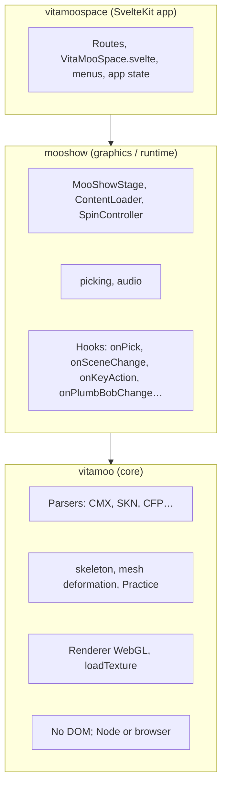

# VitaMoo — Full documentation

This document describes all layers, components, data flow, and how to reuse or extend the stack.

---

## 1. Architecture overview



- **vitamoo**: Pure animation/data core. No concept of “scene” or “UI”; only skeletons, meshes, skills, and animation ticks.
- **mooshow**: One place that knows about “bodies” (character instances), camera, input, and rendering. Exposes a single stage API and hooks so the app layer can stay UI-framework-agnostic.
- **vitamoospace**: One possible app: Svelte 5, one main component, menus bound to stage methods and hooks.

---

## 2. Layer 1: vitamoo (core)

**Path:** `vitamoo/vitamoo/`  
**Package:** `vitamoo`  
**Entry:** `vitamoo/vitamoo.ts`

### Responsibilities

- Parse and write Sims 1–style assets: CMX (skeleton/suit/skill text), SKN (mesh text), BCF/BMF/CFP (binary).
- Build and update skeletons: `buildSkeleton`, `updateTransforms`, `findBone`, `findRoot`.
- Deform meshes from skeleton state: `deformMesh`.
- Animation: `Practice` (skill + skeleton), tick and drive transforms.
- Optional WebGL: `Renderer` (canvas), `loadTexture`, `parseBMP`.

### Public API (from `vitamoo`)

- **Types:** `Vec2`, `Vec3`, `Quat`, `Bone`, `SkeletonData`, `MeshData`, `SuitData`, `SkillData`, `MotionData`, `BoneData`, `SkinData`, `BoneBinding`, `BlendBinding`, `Face`, `CMXFile`.
- **Parse/write:** `parseCMX`, `parseSKN`, `parseBCF`, `parseBMF`, `parseCFP`, `writeCMX`, `writeSKN`, `writeReport`, `writeBCF`, `writeBMF`, `writeCFP`.
- **Skeleton:** `buildSkeleton`, `findRoot`, `findBone`, `updateTransforms`, `deformMesh`.
- **Renderer:** `Renderer`.
- **I/O:** `DataReader`, `TextReader`, `BinaryReader`, `BinaryWriter`, `buildDeltaTable`, `decompressFloats`, `compressFloats`.
- **Texture:** `parseBMP`, `loadTexture`.
- **Animation:** `Practice`, `RepeatMode`.

### Boundaries

- Does **not** depend on DOM, canvas, or app-level state.
- Does **not** load content index or scenes; it only parses and animates data it is given.
- Safe to use from Node (e.g. tooling) or browser; WebGL bits are only used when you instantiate `Renderer` and pass a canvas.

### Reuse

- Use `vitamoo` alone when you need parsers, skeleton math, or mesh deformation and will supply your own render loop and I/O.
- Replace or wrap `Renderer` if you need a different WebGL setup; mooshow uses it internally but you can bypass mooshow and drive vitamoo directly.

---

## 3. Layer 2: mooshow (graphics/runtime)

**Path:** `vitamoo/mooshow/`  
**Package:** `mooshow`  
**Entry:** `mooshow/src/index.ts`  
**Dependency:** `vitamoo` (workspace)

### 3.1 MooShowStage

Central object: owns the canvas, renderer, animation loop, and all bodies. Created with:

```ts
import { createMooShowStage } from 'mooshow';

const stage = createMooShowStage({
  canvas: document.querySelector('canvas'),
  hooks: { onSceneChange: (name) => { … }, onKeyAction: (action, value) => { … } },
  assetsBaseUrl: '/data/',   // base URL for content index and assets
});
```

**Main methods:**

- **`loadContentIndex(url, onProgress?)`** — Fetches JSON index, then loads all CMX/SKN/CFP/textures into the loader store. Call once before setting scenes or characters.
- **`setScene(sceneIndex)`** — Loads the scene by index; replaces current bodies with the scene cast.
- **`setCharacterSolo(charIndex)`** — Sets bodies to one character at charIndex (same body model as scenes).
- **`setAnimation(animName, actorIndex?)`** — Sets animation for one actor or all.
- **`selectActor(idx)`** — `idx`: 0..n-1 for one body, -1 for “all”. Affects spin, plumb bob, and sound.
- **`pick(screenX, screenY)`** — Returns body index under point, or -1.
- **`start()` / `stop()`** — Start/stop the requestAnimationFrame loop.
- **`render()`** — Force one frame (e.g. after slider change).
- **`destroy()`** — Stops the loop.

**Main getters:**

- `bodies`, `selectedActor`, `activeScene`, `paused`, `running`
- `scenes`, `characters`, `skillNames` (from content index)
- `contentIndex`, `loader`, `spin`, `sound`

**Spin/camera (via `stage.spin`):**

- `rotY`, `rotX`, `zoom` — camera orbit and tilt; “Rotate” slider drives `rotY`.
- Mouse/keyboard drag applies to body spin (selected or all) or camera orbit depending on context; see stage implementation.

### 3.2 ContentLoader

Used by the stage; also exposed as `stage.loader`. Loads the content index JSON and all referenced assets.

- **`loadIndex(url)`** — Fetch and set the content index.
- **`loadAllContent(onProgress?)`** — Load CMX, SKN, CFP, textures into `store` and caches; call after `loadIndex`.
- **`loadScene(sceneIndex)`** — Returns `Body[]` for that scene (uses shared `_buildBodyFromCharacter`).
- **`loadCharacterBody(char)`** — Returns one `Body` for a character (same builder, different overrides).

**Content index shape (`ContentIndex`):**

- `scenes`: `{ name, cast: { character, actor?, x?, z?, direction?, animation? }[] }[]`
- `characters`: `{ name, skeleton?, body?, head?, leftHand?, rightHand?, bodyTexture?, headTexture?, handTexture?, animation?, voice? }[]`
- Optional: `skeletons`, `suits`, `animations`, `meshes`, `textures_bmp`, `textures_png`, `cfp_files`, `defaults`.

All bodies are created the same way; choosing a scene or a character index only changes how many bodies are loaded and which overrides (position, animation, actor name) are applied.

### 3.3 Body and runtime types

- **Body:** `skeleton`, `meshes` (mesh + boneMap + texture), `practice` (animation), `personData` (character def), `actorName`, `x`, `z`, `direction`, `spinOffset`, `spinVelocity`, `top` (TopPhysicsState).
- **TopPhysicsState:** Tilt, precession, nutation, drift for “spinning top” effect when a body is selected and spinning.

Bodies are the only runtime representation of characters.

### 3.4 SpinController

`stage.spin`: drag (left = spin+zoom, right/shift+left = orbit), wheel zoom, momentum decay. Exposes `rotY`, `rotX`, `zoom`, `rotationVelocity`, `isDragging`, `startDrag`, `drag`, `endDrag`, `applyWheel`, `tickMomentum`.

### 3.5 Picking

`pickActorAtScreen(screenX, screenY, canvasRect, width, height, bodies, cameraTarget, rotY, rotX, zoom, selectedActorIndex)`: projects body positions (e.g. spine) to screen and returns the index of the closest within a pixel radius. Used by the stage’s `pick()`.

### 3.6 SoundEngine

`stage.sound`: Web Audio for spin whoosh and Simlish-style greetings. One voice chain per body. Methods: `ensureAudio()`, `updateSpinSound(rotationVelocity, bodies, selectedActorIndex)`, `simlishGreet(actorIdx, bodies)`, `silenceAll()`.

### 3.7 Hooks (MooShowHooks)

Optional callbacks the app can pass in `StageConfig.hooks`:

- **`onPick(actorIndex, x, y)`** — User clicked on a body.
- **`onHover(actorIndex | null)`** — Hover target changed.
- **`onSelectionChange(actorIndex)`** — Selected actor changed (including after setScene/setCharacterSolo).
- **`onHighlight(actorIndex | null)`** — Highlight state changed.
- **`onPlumbBobChange(actorIndex, visible)`** — Plumb bob drawn for actor.
- **`onSceneChange(sceneName | null)`** — Scene set (name) or cleared (null).
- **`onAnimationTick(time)`** — Every frame, with current anim time.
- **`onKeyAction(action, value?)`** — Global key: stepSceneNext/Prev, stepActorNext/Prev, stepCharacterNext/Prev, stepAnimationNext/Prev, togglePause, toggleHelp, setSpeed.

Implement only the ones you need; the stage merges with `defaultHooks` (no-ops).

### 3.8 Exports from mooshow

- **Stage:** `createMooShowStage`, `MooShowStage`, `StageConfig`
- **Content:** `ContentIndex`, `CharacterDef`, `SceneDef`, `CastMemberDef`, `ContentStore`
- **Runtime types:** `Body`, `BodyMeshEntry`, `Vec3`, `TopPhysicsState`
- **Hooks:** `MooShowHooks`, `KeyAction`
- **Other:** `defaultHooks`, `SpinController`, `SoundEngine`

ContentLoader is used internally by the stage; its types are exported so the app can type content index and character defs.

---

## 4. Layer 3: vitamoospace (SvelteKit app)

**Path:** `vitamoo/vitamoospace/`  
**Package:** `vitamoospace` (private)

### Structure

- **Routes:** `+layout.svelte`, `+page.svelte` (full-page demo), `api/health/+server.ts` (placeholder).
- **Component:** `src/lib/components/VitaMooSpace.svelte` — one component that owns the canvas, creates the stage, loads the content index, and wires:
  - Scene / Actor / Character / Animation dropdowns to `setScene`, `selectActor`, `setCharacterSolo`, `setAnimation`.
  - Bottom bar: distance presets, Rotate/Tilt/Zoom/Speed sliders, Pause, Help.
  - Hooks: `onSceneChange`, `onSelectionChange`, `onKeyAction` to sync app state and menus.
- **State:** `src/lib/stores/app-state.svelte.ts` — Svelte 5 runes (e.g. current scene index, actor index, character index, animation name, loading message).

### Data and assets

- Content index and assets are served from `vitamoospace/static/data/` (e.g. `content.json`, CMX, SKN, BMP, CFP). Copy or symlink from your vitamoo build or demo data.
- `assetsBaseUrl` is set so the stage loads from `/data/` (or the same path with a base path if using SvelteKit `paths.base`).

### Build and deploy

- **Static:** `@sveltejs/adapter-static`; output is in `vitamoospace/build`. Suitable for GitHub Pages or any static host.
- **Node server:** `@sveltejs/adapter-node` available for a future server; health endpoint is non-prerendered when using static.

---

## 5. Data flow summary

1. App or user triggers “load content” → stage calls `loader.loadIndex(url)` then `loader.loadAllContent(onProgress)`.
2. User selects scene or character → stage calls `loader.loadScene(i)` or `loader.loadCharacterBody(char)`; both use `_buildBodyFromCharacter` and produce a `Body[]` (one or many).
3. Stage sets `_bodies`, camera target, and selection; fires `onSceneChange` / `onSelectionChange`.
4. Every frame: animation tick for each body’s `practice`, top physics for selected bodies, momentum decay, spin sound update; then render meshes and plumb bobs.
5. Input (mouse/key) updates `stage.spin` and/or body `spinOffset`; keyboard can trigger `onKeyAction` for the app to change scene/actor/character/animation.

---

## 6. How to reuse and extend

### Use only vitamoo

- Add `vitamoo` as a dependency; import parsers, `buildSkeleton`, `updateTransforms`, `deformMesh`, `Practice`.
- You own loading (content index, fetch), rendering (your WebGL or other), and input. No stage, no bodies array from this repo.

### Use mooshow with your own UI

- Add `mooshow` (and thus `vitamoo`) as dependencies.
- Create a canvas, `createMooShowStage({ canvas, hooks, assetsBaseUrl })`, then `loadContentIndex(...)`, `setScene(0)` or `setCharacterSolo(0)`, `start()`.
- Bind your UI to `stage.scenes`, `stage.characters`, `stage.skillNames`, `stage.bodies`, `stage.selectedActor` and call `setScene`, `setCharacterSolo`, `selectActor`, `setAnimation`; use `onSceneChange`, `onSelectionChange`, `onKeyAction` to keep your state in sync.
- Override `assetsBaseUrl` and put your `content.json` and assets where your app serves them.

### Custom content index or assets

- Keep the same `ContentIndex` / `CharacterDef` / `SceneDef` / `CastMemberDef` shape so `ContentLoader` and `_buildBodyFromCharacter` work.
- Add fields to character defs (e.g. `voice`) and use them in your hooks or in mooshow’s sound (e.g. `resolveVoiceParams(b.personData)` already reads from `personData`).

### New app (React, Vue, etc.)

- Same as “mooshow with your own UI”: depend on `mooshow`, create stage, load content, wire your components to stage API and hooks. No need to use Svelte or vitamoospace.

### Extend mooshow

- Add new hooks in `MooShowHooks` and call them from the stage where appropriate.
- Add options to `StageConfig` (e.g. default zoom, key bindings) and use them in `_bindCanvasEvents` or the loop.
- Keep a single bodies array and avoid a second “mode” or parallel state so the design stays simple.

### Design goal: Snap! integration

**Cool idea:** Integrate mooshow into [Snap!](https://snap.berkeley.edu/) (browser-based visual programming). The stage API is imperative and UI-framework-agnostic: create a canvas, call `loadContentIndex`, `setScene`, `setCharacterSolo`, `selectActor`, `setAnimation`, and wire hooks. Snap! could expose blocks like "load scene", "play animation", "pick actor at mouse" and drive the same stage from its block runtime. Because mooshow owns only the canvas and hooks (no Svelte or app shell), the integration surface is small: a Snap! extension that instantiates the stage, mounts it in a stage div, and maps blocks to stage methods and hook callbacks. A natural design goal for the stack is to keep that surface narrow so a Snap! (or similar) integration stays tractable.

### Plan for mooshow: hybrid rendering (Sims-style)

**Goal:** Support a hybrid z-buffer, sprite, and procedural-architecture pipeline like The Sims. Render terrain, grass, floors, walls, roofs, and other architecture procedurally or from tiles; render Sims-style objects with z-buffered sprites; and run vitamoo characters (skinned meshes, animation) inside the same scene so characters live in the world. One unified stage: environment + objects + characters, with correct depth ordering and a single camera.

**WebGPU (current):** The live renderer is **WebGPU-only** (WGSL, depth buffer, dual-render-target object IDs). There is no WebGL path. Character meshes still use **CPU** `deformMesh` each frame; the GPU draws deformed vertices and writes pick ids. Roadmap: holodeck layers (background, terrain, walls) in `docs/WEBGPU-RENDERER-DESIGN.md` §4; optional **GPU skeletal deformation** in §5. Day-to-day handoff: `docs/WEBGPU-HANDOFF-CONTEXT.md`.

**Object ID and layered sprites:** The main pass writes an **`rgba32uint` id attachment** (type, object id, sub-object id) alongside color; mooshow uses `readObjectIdAt` for picking. That same output can feed **RGB + alpha + z layered sprites** for authoring: render assets (OBJ, glTF, Sims-era data) into color, alpha, and depth, then use layers as z-buffered sprites in the holodeck.

**Reusable renderer vision:** The same WebGPU renderer is intended for:

- **Holodeck-style runtime:** Pre-rendered z-buffered background (rooms, terrain, props as layered sprites) plus real-time polygon characters (vitamoo skinned meshes). One camera, one depth buffer, correct ordering.
- **Sims object creation tools:** Load or import 3D geometry, render to RGB/alpha/z layers, export or pack as object art for use in-game or in save files.
- **Save file viewing and editing:** Same rendering pipeline to display and edit saved lots/households/objects with consistent look and picking.

So the renderer is not only for the current character viewer: it is shared infrastructure for holodeck runtime, object authoring, and save-file tooling.

---

## 7. Build and run

From the **repository root** (where `pnpm-workspace.yaml` is, i.e. the SimObliterator_Suite root):

```bash
pnpm install
pnpm --filter vitamoo run build
pnpm --filter mooshow run build
pnpm --filter vitamoospace run build
pnpm --filter vitamoospace run preview
```

Order matters: vitamoospace depends on mooshow, mooshow on vitamoo. For development, run `build` for the packages you change, then run or preview the app.

- **vitamoo:** `npm run build` (or `pnpm --filter vitamoo run build`) → `vitamoo/dist/`.
- **mooshow:** `pnpm --filter mooshow run build` → `mooshow/dist/`.
- **vitamoospace:** `pnpm --filter vitamoospace run build` → `vitamoospace/build/` (static) or run `vite dev` for dev server.

Demo assets: ensure `vitamoospace/static/data/` contains `content.json` and the CMX/SKN/BMP/CFP files referenced there (e.g. copy from `vitamoo/dist/` or your own content pack).

### If pnpm doesn't handle dependencies

- **Hoisting:** Some environments or tools fail with pnpm's strict `node_modules` layout. At the **repository root** (same directory as `pnpm-workspace.yaml`), add a `.npmrc` with `public-hoist-pattern[]=*` or `shamefully-hoist=true`, then run `pnpm install` again so dependencies are hoisted and easier to resolve.
- **Build in dependency order with npm:** Skip pnpm and use npm from each package directory. From the repo root:
  1. `cd vitamoo && npm install && npm run build`
  2. `cd mooshow` — mooshow declares `vitamoo` with `workspace:*`. For npm you need a local link: either `npm link ../vitamoo` (after `npm run build` in vitamoo) or temporarily set `"vitamoo": "file:../vitamoo"` in `mooshow/package.json`, then `npm install && npm run build`
  3. `cd vitamoospace` — same idea: use `npm link ../mooshow` or `"mooshow": "file:../mooshow"`, then `npm install && npm run build && npm run preview`
  That way installs and builds don't rely on pnpm's workspace resolution.
- **Yarn (if the repo adds workspace support):** If the root gets a `package.json` with `"workspaces": ["vitamoo", "vitamoo/mooshow", "vitamoo/vitamoospace"]`, `yarn` at root can install and link; `yarn workspace vitamoo build`, etc. Right now the repo is pnpm-oriented, so npm-per-package or pnpm with hoisting are the main fallbacks.
